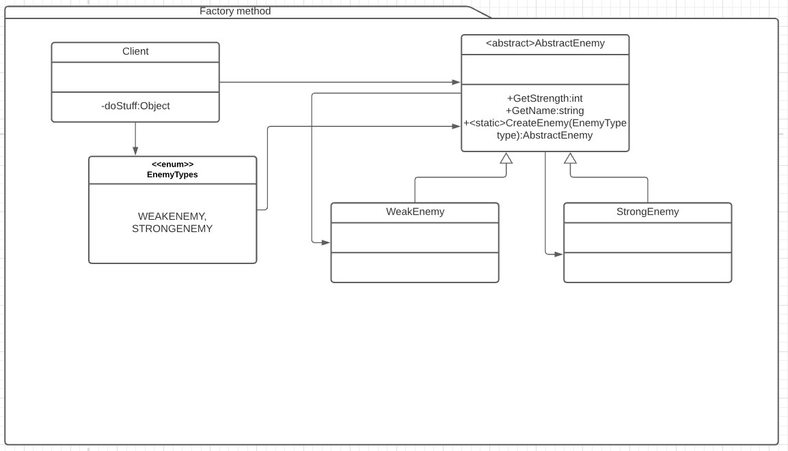

# Factory method
Es un patrón creacional. [Link descripción](https://sourcemaking.com/design_patterns/factory_method)

El factory method es un método, generalmente estático, con el objetivo de devolver instancias concretas de una interfaz conocida.

## Diagrama de clases

## SOLID

* Single responsibility

El factory method tiene como responsabilidad generar instancias de clases que implementen una interfaz común

* Open/Closed principle

Es dificil cumplir este principio ya que al crearse nuevas implementaciones de la interfaz responsabilidad del factory method, el método debera modificarse para incluir los nuevos casos de uso.

* Liskov substitution 

Cualquier clase que implemente la interfaz puede ser intercambiada sin consecuencias, de hecho es uno de los principios de utilizar un factory method, generar independencia entre el cliente y la implementación de la interfaz necesitada

* Interface segregation

Un buen modelado de clases debería permitir segregación de interfaces en el factory method.

* Dependency inversión

Ya que el cliente solo necesita conocer la interfaz devuelta por el factory method esto se cumple, aunque no tengo muy claro si la dependencia del factory method en sí con las implementaciones cuenta como violación del principio.